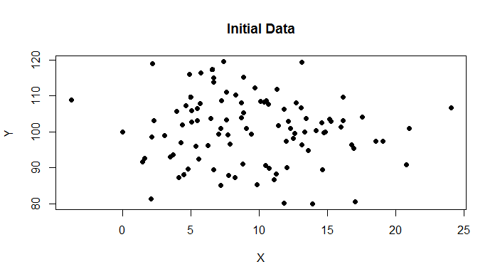
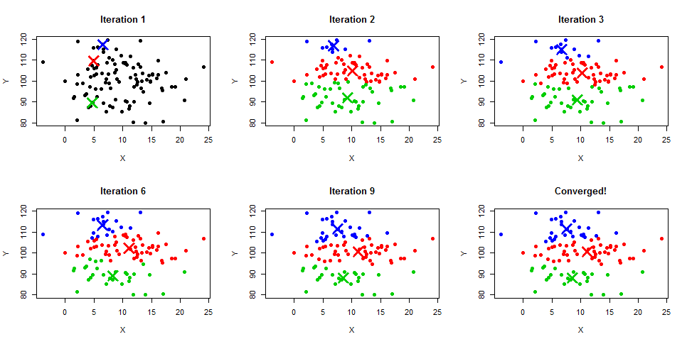

## скачайте для верного отображения формул
## Задачи машинного обучения. Supervised и unsupervised. Регрессия, классификация, кластеризация. Метрики качества. 

### Типы задач 

Рассмотрим типы задач, которые встречаются в машинном обучении.

##### Классификация.  

Рассмотрим следующую задачу. Мы работаем в банке и нам необходимо, чтобы система определяла, сможет ли человек вовремя погасить кредит или нет. У нас есть различная информация о человеке, так называемые признаки (features). Они бывают различных типов:
- Бинарные признаки: наличие телефона.
- Номинальные признаки: профессия, адрес проживания.
- Порядковые признаки: образование, занимаемая должность. По сути, они похожи на номинальные признаки, только тут у значений признака имеется порядок (высшее образование ценится выше среднего и т.д.).
- Количественные признаки: зарплата, возраст, количество детей в семье и т.п.

Ответ же к данной задаче либо $0$ (человек не выплатит кредит вовремя), либо $1$ (человек выплатит кредит вовремя). Т.е. в задаче классификации значение, которое мы хотим предсказать (далее  *целевая переменная*), принадлежит конечному множеству. В нашей задаче, например, это $\{0;1\}$. Бывают множества не только из $2$ классов. Например, задача диагностики болезни по симптомам. Тут классы  —  это список болезней.

Как решается данная задача? В таких задачах нам требуется  обучающая выборка. Это история того, как в прошлом наши клиенты выплачивали кредиты. Мы знаем о них все: где они работают, сколько получают и т.п. А так же нам известно смогли они выплатить кредит или нет. Знание того, что мы предсказываем (*целевой переменной*) относит задачу к задачам *обучения с учителем*.

Далее модель машинного обучения находит закономерности в этой выборке. Например, если человек безработный, то скорее всего, он не выплатит кредит вовремя и т.д. Она запоминает эти закономерности, и когда приходит черёд узнать, а сможет ли новый клиент заплатить кредит вовремя, модель смотрит на эти зависимости и выдаёт ответ. Список новых клиентов называется  *тестовой выборкой*. Главное её отличие от обучающей выборки заключается в том, что для элементов из тестовой выборки неизвестна целевая переменная (в нашем случае — это выплатит клиент кредит или нет). 

##### Регрессия

Еще одним типом является регрессия. Например, можно рассмотреть такую задачу: мы хотим по росту родителей определить насколько высоким может быть их ребёнок. Действительно, как правило, есть зависимость, что у высоких родителей дети тоже имеют высокий рост и наоборот. Т.е. от классификации задача регрессии отличается тем, что тут целевая переменная  — вещественное число. 

Обучающей выборкой в данной задаче будет набор троек: (рост родителя №1, рост родителя №2, рост ребёнка). Тестовой выборкой — набор двоек: рост родителя №1 и рост родителя №2.

##### Кластеризация

В обучающих выборках, рассмотренных выше задач, нам было известна целевая переменная:
- Выплатит ли человек кредит вовремя — в задаче классификации;
- Рост ребенка — в  задаче регрессии.

Однако, целевая переменная не всегда известна. Например, мы провели социологический опрос, у нас есть много ответов на вопросы и нам хотелось бы сгруппировать их по поведению. Мы заранее не знаем, сколько таких кластеров получится и что они из себя представляют. Это мы можем узнать только после того как появятся сами кластеры.

Еще простой и пробирочной задачей кластеризации является кластеризация точек на плоскости:

#### Алгоритм KNN для задачи классификации 

Рассмотрим один из самых простых алгоритмов для задачи классификации KNN — $k$ ближайших соседей. Пусть перед нами стоит задача бинарной классификации — $0$ или $1$. Рассмотрим ситуацию, когда все признаки — вещественные числа. В дальнейшем, при изучении курса вы сумеете переводить номинальные и порядковые признаки в числа. Пусть у нас имеется обучающая выборка $X_{train} = \{x_1, \dots, x_N \}$, где каждый $x_1$ — это вектор из $m$ признаков. Для каждого объекта из обучающей выборки известна целевая переменная $y_i \in \{0; 1\}$. А так же пусть имеется тестовая выборка $X_{test} =\{x_{N+1}, \dots, x_{N+M}\}$. Для них неизвестна целевая переменная, это мы должны выяснить сами.

Сам алгоритм:
1. Для каждого из объектов тестовой выборки $x_{N+i}$ находим $k$ ближайших к нему соседей из обучающей выборки $X_{train}$. Ближайших в смысле Евклидового расстояния:
$p(x;y)=\sqrt{(x_1-y_1)^2+\dots+(x_m-y_m)^2}$
2. Если среди этих ближайших соседей больше нулей, то для объекта $x_{N+i}$ выдаем ответ $0$, иначе — $1$.

Вот и весь алгоритм. Его можно немного модифицировать — использовать вместо Евклидового расстояния другие метрики. К сожалению, алгоритм не часто используется на практике, но неплохо подходит для обучения.

#### Алгоритм k-means для задачи кластеризации 

Рассмотрим теперь задачу кластеризации и алгоритм k-means для ее решения. Пусть в качестве объектов у нас $N$ точек на плоскости: $\{(x_1, y_1), \dots,(x_N , y_N )\}$

Мы хотим разбить эти точки на $k=3$ кластера.
1. Выбираем $k=3$ случайные точки из этого множества. Говорим, что они теперь являются центрами наших кластеров.
2. Для каждой из оставшихся точек смотрим, к какому из центров она ближе и определяем её в этот кластер.
3. У нас получилось разбить точки на $3$ кластера. Естественно это не оптимальное решение. Найдем новые центры кластеров, а именно посчитаем центры масс каждого кластера. Например, если точки $\{(x_{i_1}, y_{i_1}), \dots, (x _{i_n}, y_{i_n})\}$ попали в один кластер, то его новый центр масс будет иметь координаты: $x_M =\frac{x_{i_1}+\dots+x_{i_n}}{n}$; $y_M =\frac{y_{i_1}+\dots+y_{i_n}}{n}$.
4. Далее с этими новыми центрами масс переходим к шагу $2$. Продолжаем до тех пор пока кластеры перестанут меняться.

