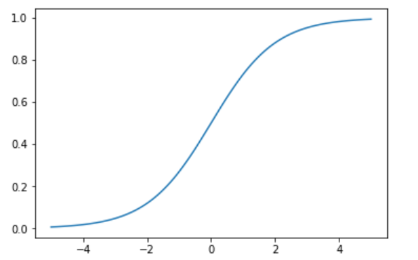

## Классификация

### Логистическая регрессия
Рассмотрим  задачу классификации. Для простоты рассматрим бинарную классификацию: для каждого примера в обучающей выборке указан его класс: $$0$$ или $$1$$. Нам нужно по признакам научиться восстанавливать класс.

Мы уже умеем предсказывать числа (решать задачу регрессии) с помощью модели Линейной регрессии. Самое простое --- использовать её для предсказания классов? А именно, будем просто предсказывать эти $$0$$ и $$1$$. Тут даже понятно как решать по предсказанному числу, какой это класс: если больше $$0.5$$, то класс $$1$$, иначе класс $$0$$.

Этот подход работает, но он несколько противоестественный: предположим, наша модель предсказала для объекта класса $$1$$ значение $$2$$. За такое предсказание она получит такой же штраф, как за предсказание $$0$$: $$(2-1)^2 = (0-1)^2$$

Давайте попробуем придумать более естественную функцию потерь. Естественно считать, что чембольше предсказание нашей модели, тем сильнее она уверена, что объект принадлежит классу $$1$$. Давайте попробуем интерпретировать предсказание модели как вероятность того, чтообъект принадлежит классу $$1$$. 

Модель (теоретически) может выдавать значения от минус до плюс бесконечности, значит нам нужно научиться превращать интервал $$(-\infty, \infty)$$ в интервал $$(0, 1)$$. Такие функции называют сигмоидами --- потому что они напоминают внешне букву $$s$$. Наиболее стандартная такая функция называется логистической функцией и выглядит так: 
$$\sigma (x) = \frac{1}{1 + e^{-x}}$$

Итак, можно считать, что если наша модель предсказывает для объекта $$x$$ число $$f(x)$$ это означает, что $$p_x = \sigma(f(x))$$ --- вероятность того, что объект принадлежит к классу $$1$$.

Для данного примера класса $$1$$ вероятность того, что наша модель "угадает" значение всех элементов:
$$\prod_{x \in 1} p_x \prod_{x \in 0} (1-p_x)$$

Мы хотим максимизировать эту вероятность. Работать с произведением неудобно, поэтому возьмем логарифм:
$$\sum_{x \in 1} \ln(p_x)  + \sum_{x \in 0} \ln(1-p_x)$$

Из этого бы получилась отличная функция потерь, вот только функцию потерь мы хотим минимизировать, а эту функцию нужно максимизировать для лучшего результата. Поэтому умножим её на минус один.
$$Logloss = -\sum_{x \in 1} \ln(p_x)  - \sum_{x \in 0} \ln(1-p_x)$$

Эта функция потерь называется $$Logloss$$. Оказывается, что её довольно просто оптимизировать.

Описанный нами алгоритм называется Логистическая регрессия. Это алгоритм бинарной классификации (а не регрессии, пусть название вас не путает):
- алгоритм предсказывает $$f(x)$$ по модели линейной регрессии:
$$f(x) = a_0 + a_1 x_1 + \ldots +a_n x_n$$
- от каждого значения считается сигмоида для предсказания вероятности:
$$p_x = \sigma(f(x)) = \frac{1}{1 + e^{f(x)}}$$
- по этим вероятностям считается $$Logloss$$: 
$$Logloss = -\sum_{x \in 1} \ln(p_x) - \sum_{x \in 0} \ln(1-p_x)$$
- параметры для модели подбираются так, чтобы именно этот логлосс и был минимален
- предсказание после этого делается так: если вероятность больше $$0.5$$ (то есть $$f(x) > 0$$), то это класс $$1$$, иначе это класс $$0$$.

Можно также представить, что вы пытаетесь разделить точки двух разных цветов с помощью плоскости. Все точки, оказавшиеся в одном полупространстве, вы предсказываете как класс $$0$$, а в другом --- как класс $$1$$.

Домашка в коллабе.