## Feature-инжиниринг

### Пропуски в данных

Рассмотрим датасет communities and crime. Этот датасет содержит различные признаки, которые характеризуют район. Задача предсказать уровень преступности на 100 тысяч человек. Это задача регрессии.

```
import numpy as np
import pandas as pd

# Датасет взят отсюда: http://archive.ics.uci.edu/ml/datasets/communities+and+crime
# Загружаем датасет

x = pd.read_csv('data/communities.csv')
x.info()
```

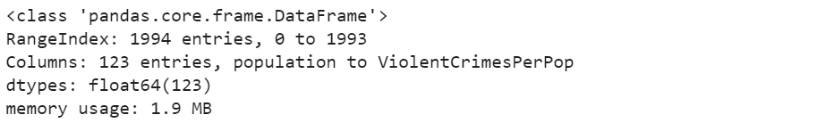

Итак, у нас $$1994$$ района и $$122$$ признака, ViolentCrimesPerPop наша таргетная переменная.

Давайте взглянем на данные:
```
# Посмотрим на данные:
x.head()
```
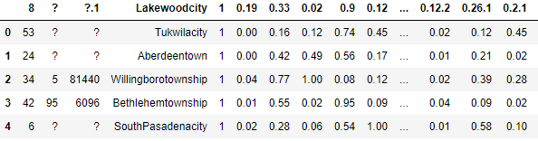

Видим глазами много пропусков. А как узнать сколько значений не известно?
```
x.isna().any().sum() # сколько признаков содержат неизвестные значения
```
Output: `23`

```
x.isna().sum()[-10:] # cколько неизвестных значений содержит каждый признак
```
Output:
```
LandArea                  0
PopDens                   0
PctUsePubTrans            0
PolicCars              1675
PolicOperBugd          1675
LemasPctPolicOnPatr    1675
LemasGangUnitDeploy    1675
LemasPctOfficDrugUn       0
PolicBugdPerPop        1675
ViolentCrimesPerPop       0
dtype: int64
```

##### Как быть?

- **Удалить лишнее**
    - Выкинуть данные с неизвестным признаком
    - Выкинуть признак, если он имеет слишком мало известных значений
- **Восстановить значения**
  *В англоязычной терминологии это называется imputation.*
- **Для вещественных признаков**
    - Заполнить все пропуски средним (модой, медианой) значениями признака
    - Предсказывать значение пропущенного признака с помощью линейной регрессии
- **Для категориальных**
    - Отдельное значением типа "n/a"
    - Использовать самое частое значение признака

Хорошая идея также добавить отдельный признак `A_missing` и присваивать ему значение $$1$$ всякий раз, когда значение признака A пропущено. Более подробно можно почитать [здесь](https://towardsdatascience.com/how-to-handle-missing-data-8646b18db0d4).

```
# Заполняем все пропуски в данных средними значениями для каждого признака
from sklearn import preprocessing

mis_replacer = preprocessing.Imputer(strategy="mean")
x = pd.DataFrame(data=mis_replacer.fit_transform(x), columns=x.columns)
```

```
# Aльтернатива через pandas
# Подробнее в описании функции
x.fillna(value=0, inplace=True)
```

### Категориальные признаки

Для примера создадим небольшую табличку

```
import pandas as pd

# просто табличка для примера
def create_data():
    return (pd.DataFrame({'city': ['Moscow', 'London', 'London', 'Kiev',
                                   'Moscow', 'Moscow', 'Kiev','Moscow'],
                          'degree': [1,1,2,2,3,3,1,1],
                          'class':['A','B','A','A','B','B','A','A'],
                          'income':[10.2, 11.6, 8.8, 9.0, 6.6, 10.0, 9.0, 7.2]}))

data = create_data()
data
```
Output:
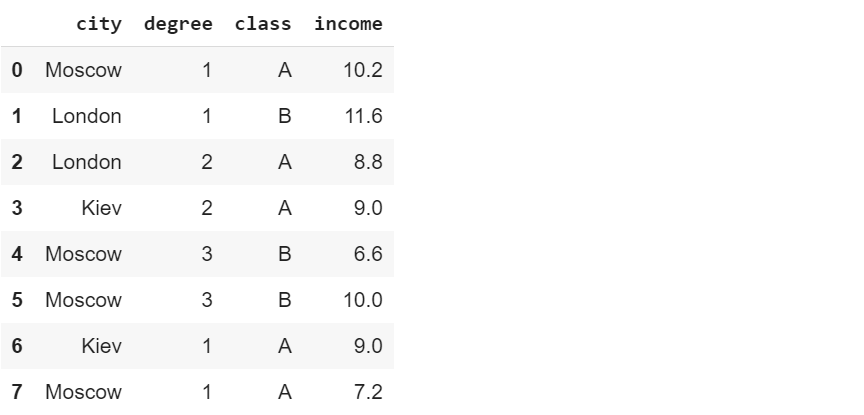

##### Как понять, что признак категориальный?

*Идея:* категориальные признаки те, в которых значения --- строки или число уникальных значений достаточно мало.
```
# найти все признаки, в которых первое значение - строка 
def find_cat(data, num_uniq=4):
    for name in data.columns:
        s = ''
        s += name
        if (type(data[name][0]) == str):
            s += ' строка,'
        if (data[name].nunique()<=num_uniq):
            s += ' мало уникальных'
        if (s!=name):
            print (s)
            
find_cat(data)
```
Output:
```
city строка, мало уникальных
degree мало уникальных
class строка, мало уникальных
```

##### Как подавать категориальные признаки алгоритму?

Алгоритмы хотят, чтобы им на вход подавали числа, а не строки. Кроме того, большая часть алгоритмов машинного обучения тем или иным образом использует понятие расстояния между точками. Поэтому приходится подумать как же так представить категориальный признак, чтобы все заработало.

Существует как минимум $$2$$ *популярных подхода*:
1. **one-hot кодирование**
   Этот способ наиболее универсален и применяется по умолчанию. Универсальность здесь означает     возможность использования такого представления в любом алгоритме машинного обучения.
   Суть в том, что каждое значение категориального признака порождает свой собственный признак.     Далее, кодируем нулями и единицами отсутствие или наличие соответствующего признака.
   Если хочется больше гибкости, можно попробовать для тех же целей воспользоваться      `OneHotEncoder` из `sklearn.preprocessing`
    ```
    # Очень просто с помощью pandas
    # Заметим при этом, что `degree` и `income` остались неизменными.
    pd.get_dummies(data)
    ```
   Output:
   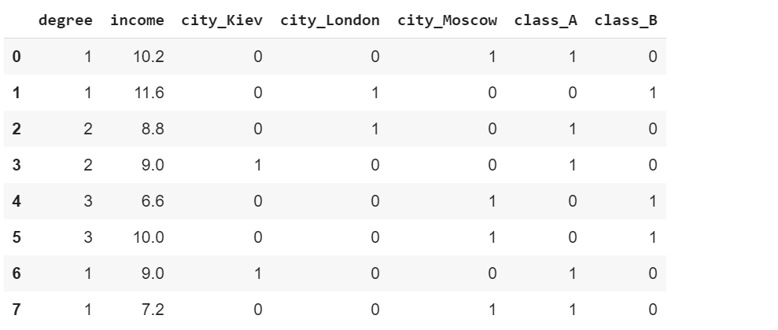

2. **Группирова числовых признаков по категориальным**
   Например, для каждого значения признака city из нашей таблички можно посчитать среднее значение income.
    ```
    # функция возвращает значения нового признака
    def code_mean(data, cat_feature, real_feature):
        return (data[cat_feature].map(data.groupby(cat_feature)[real_feature].mean()))
    
    
    data = create_data()
    data['city_mean_income'] = code_mean(data, 'city', 'income')
    data[:6]
    ```
   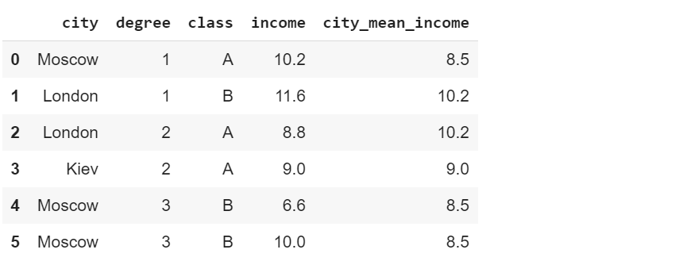

    ```
    code_mean(data, 'city', 'income')
    ```
   Output:
    ```
    0     8.5
    1    10.2
    2    10.2
    3     9.0
    4     8.5
    5     8.5
    6     9.0
    7     8.5
    Name: city, dtype: float64
    ```

##### Дата и время

Для примера рассмотрим датасет UFO (оригинальная полная версия датасета находится [здесь](https://www.kaggle.com/NUFORC/ufo-sightings)), в котором для каждого события известна дата и конкретное время.

```
df = pd.read_csv("data/ufo.csv")
df.head()
```
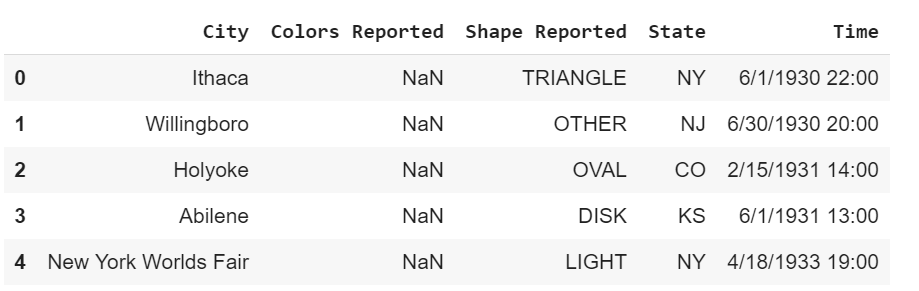

```
# посмотрим типы столбцов в таблице
df.dtypes 
```
Output:
```
City               object
Colors Reported    object
Shape Reported     object
State              object
Time               object
dtype: object
```

```
# Переводим Time в формат времени
# Теперь для столбца "Time" тип изменился
df['Time'] = pd.to_datetime(df.Time)
df.dtypes
```
Output:
```
City                       object
Colors Reported            object
Shape Reported             object
State                      object
Time               datetime64[ns]
dtype: object
```

Правильный формат данных для хранения даты времени позволяет сразу получать категориальные признаки:
```
# Какой час
df.Time.dt.hour.head()
```
Output:
```
0    22
1    20
2    14
3    13
4    19
Name: Time, dtype: int64
```

```
# Название дня недели
df.Time.dt.weekday_name.head()
```
Output:
```
0     Sunday
1     Monday
2     Sunday
3     Monday
4    Tuesday
Name: Time, dtype: object
```

```
# Является ли этот день выходным
df['is_weekend'] = df['Time'].apply(lambda x: 1 if x.date().weekday() in (5, 6) else 0)
df.head()
```
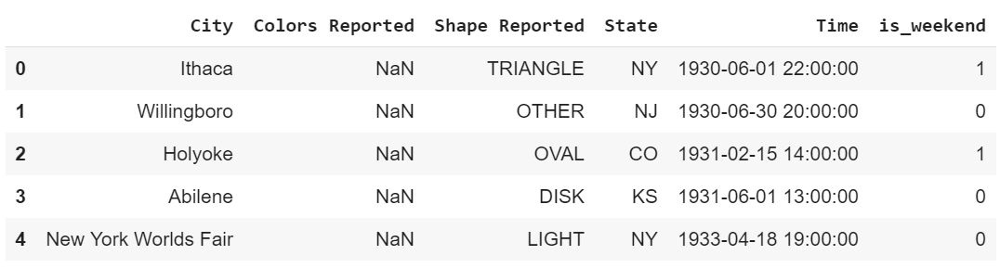

##### Проекция на окружность и использованием 2х координат

**Идея взята из курса [ml course open](https://medium.com/open-machine-learning-course/open-machine-learning-course-topic-6-feature-engineering-and-feature-selection-8b94f870706a)

Использование более эзотерических подходов для нормализации значения времени:
```
def make_harmonic_features(value, period=24):
    value *= 2 * np.pi / period
    return np.cos(value), np.sin(value)

make_harmonic_features(12)
```
Output:
```
(-1.0, 1.2246467991473532e-16)
```

##### Геоданные

**Идея взята из курса [ml course open](https://medium.com/open-machine-learning-course/open-machine-learning-course-topic-6-feature-engineering-and-feature-selection-8b94f870706a)

Возможно находить строковый адрес по данным координатам локации, однако это требует большой аккуратности в интерпретации и чистке полученных значений.
```
!pip install reverse_geocoder
```

```
import reverse_geocoder as revgc
revgc.search((40.74482, -73.94875))
```
Output:
```
[OrderDict([('lat', '40.74482'),
            ('lon', '-73.94875'),
            ('name', 'Long Island City'),
            ('admin1', 'New York'),
            ('admin2, 'Queens County),
            ('cc', 'US')])]
```

### Полезные преобразования данных

Иногда числовые значения признаков хорошо бы привести к другим значениям с помощью преобразований. Очень часто это может улучшить результаты некоторых алгоритмов. Такие алгоритмы, как правило, делают некоторые предположения о характере данных или же опираются на расстояния между элементами выборки.

**Популярные преобразования**
- **Z-score**
  $$z(x) = \frac{x-\mu}{\sigma}$$
    - Полезно, если существенно расстояние между точками (например в knn)
    - Это преобразование линейное, оно не меняет распределение данных
    ```
    # Есть в sklearn
    from sklearn.preprocessing import StandardScaler
    
    # Обратим внимание на значение 100
    data = np.array([1, 1, 0, -1, 2, 3, -2, 4, 100], dtype=np.float32).reshape(-1,1)
    StandardScaler().fit_transform(data)
    ```
  Output:
    ```
    array([[-0.3529866 ],
           [-0.3529866 ],
           [-0.3850763 ],
           [-0.417166  ],
           [-0.32089692],
           [-0.2888072 ],
           [-0.44925568],
           [-0.25671753],
           [ 2.8238928 ]], dtype=float32)
    ```
    ```
    # Это то же самое, что сделать это руками:
    (data - data.mean()) / data.std()
    ```
  Output:
    ```
    array([[-0.3529866 ],
           [-0.3529866 ],
           [-0.3850763 ],
           [-0.417166  ],
           [-0.32089692],
           [-0.2888072 ],
           [-0.44925568],
           [-0.25671753],
           [ 2.8238928 ]], dtype=float32)
    ```
- **MinMax Scaling**
  Другой достаточно популярный вариант --- MinMax Scaling, который переносит все точки на заданный отрезок (обычно $$(0, 1)$$)
  $$X_{norm}=\frac{X-X_{min}}{X_{max}-X_{min}}$$
    - Полезно, если хочется оценить влияние признака по весам в линейной регрессии
    - Можно перенести значение признака в интервал (0, 255) для визуализации
    ```
    # Демонстрация
    from sklearn.preprocessing import MinMaxScaler
    MinMaxScaler().fit_transform(data)
    ```
  Output:
    ```
    array([[0.02941177],
           [0.02941177],
           [0.01960784],
           [0.00980392],
           [0.03921569],
           [0.04901961],
           [0.        ],
           [0.05882353],
           [1.0000001 ]], dtype-float32)
    ```
    ```
    (data - data.min()) / (data.max() - data.min())
    ```
  Output:
    ```
    array([[0.02941177],
           [0.02941177],
           [0.01960784],
           [0.00980392],
           [0.03921569],
           [0.04901961],
           [0.        ],
           [0.05882353],
           [1.        ]], dtype-float32)
    ```
- **Логарифмирование**
  (как способ бороться с тяжелыми хвостами)
    - Существует ряд преобразований, которые позволяют из распределения с "тяжелым хвостом" (в английском варианте long tail) сделать распределение похожее на нормальное.
    - Нормальное распределение нравится многим алгоритмам машинного обучения и такое преобразование иногда может улучшить ситуацию.
    ```
    # Настраиваем параметры отрисовки графиков
    %pylab inline
    plt.style.use('ggplot')
    plt.rcParams['figure.figsize'] = (10,4)
    plt.rcParams['font.family'] = 'serif'
    plt.rcParams['font.serif'] = 'Ubuntu'
    plt.rcParams['font.monospace'] = 'Ubuntu Mono'
    plt.rcParams['font.size'] = 10
    plt.rcParams['axes.labelsize'] = 10
    plt.rcParams['axes.labelweight'] = 'bold'
    plt.rcParams['xtick.labelsize'] = 15
    plt.rcParams['ytick.labelsize'] = 15
    plt.rcParams['legend.fontsize'] = 10
    plt.rcParams['figure.titlesize'] = 12
    ```
    ```
    from scipy.stats import lognorm
    
    # сгенерируем себе выборку
    
    data = lognorm(s=1).rvs(1000)
    plt.hist(data, bins=100)
    plt.title("Классический пример `long tail`")
    plt.show()
    ```
  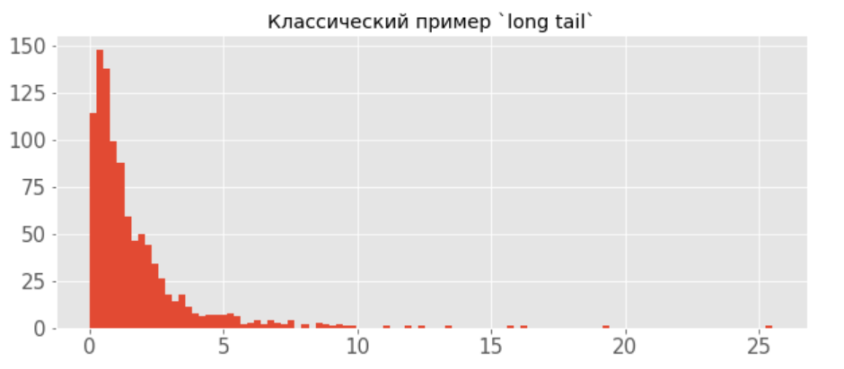

    ```
    # А вот так выглядят данные после логарифмирования
    
    plt.hist(np.log(data))
    plt.title("Log(data)")
    plt.show()
    ```
  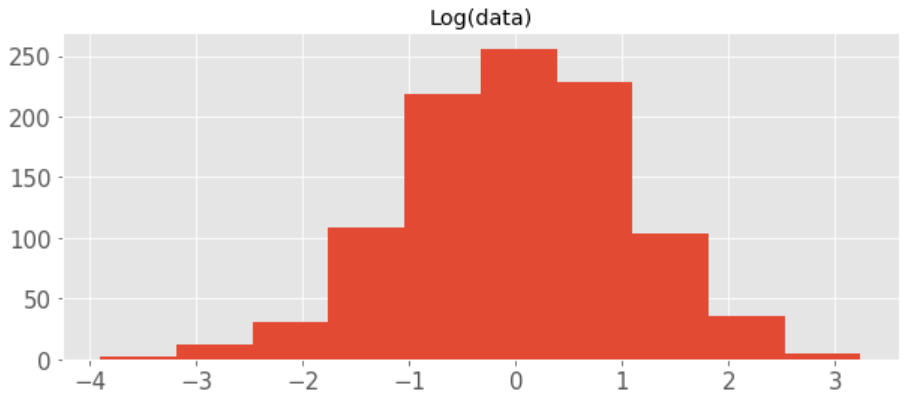

### Инжинирим признаки
Как помочь нашей модели найти полезные зависимости в данных?

Можно условно поделить генерацию признаков на **две части**:
1. Создание признаков **на основе знаний** и житейского опыта
2. Создание различных **взаимодействий** признаков
   Полиномиальные признаки

##### XOR проблема

XOR -- это "исключающее ИЛИ", булева функция со следующей таблицей истинности:
```
# порождаем данные
rng = np.random.RandomState(0)
X = rng.randn(200, 2)
y = np.logical_xor(X[:, 0] > 0, X[:, 1] > 0)
plt.scatter(X[:, 0], X[:, 1], s=30, c=y, cmap=plt.cm.Paired)
plt.show()
```
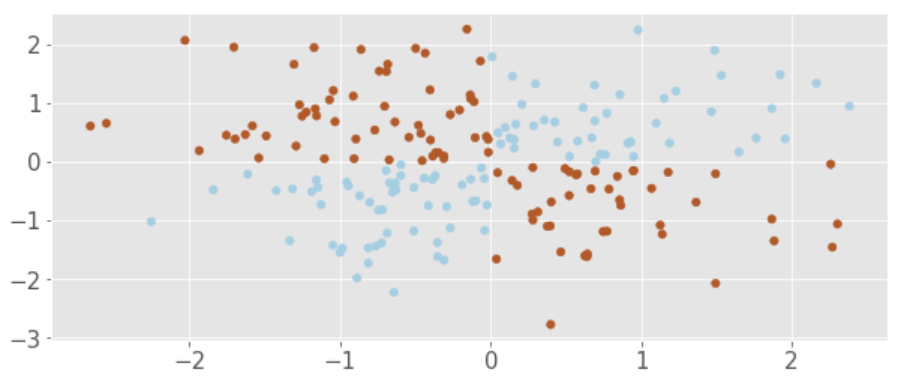

```
import warnings
warnings.filterwarnings('ignore')

# Функция рисует плоскость согласно предсказаниям классификатора clf
def plot_boundary(clf, X, y, plot_title):
    xx, yy = np.meshgrid(np.linspace(-3, 3, 50),
                     np.linspace(-3, 3, 50))
    clf.fit(X, y)
    # plot the decision function for each datapoint on the grid
    Z = clf.predict_proba(np.vstack((xx.ravel(), yy.ravel())).T)[:, 1]
    Z = Z.reshape(xx.shape)

    image = plt.imshow(Z, interpolation='nearest',
                           extent=(xx.min(), xx.max(), yy.min(), yy.max()),
                           aspect='auto', origin='lower', cmap=plt.cm.PuOr_r)
    contours = plt.contour(xx, yy, Z, levels=[0], linewidths=2,
                               linetypes='--')
    plt.scatter(X[:, 0], X[:, 1], s=30, c=y, cmap=plt.cm.Paired)
    plt.xticks(())
    plt.yticks(())
    plt.xlabel(r'$x_1$')
    plt.ylabel(r'$x_2$')
    plt.axis([-3, 3, -3, 3])
    plt.colorbar(image)
    plt.title(plot_title, fontsize=12);


from sklearn.linear_model import LogisticRegression
# Применяем логистическую регрессию к нашим данным
# И видим, что линейная модель не способна разделить точки правильно
plot_boundary(LogisticRegression(), X, y, "Logistic Regression, XOR problem")
```
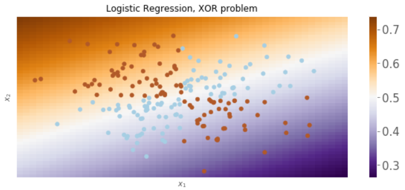

**Что мы делаем?** Добавляем полиномиальные признаки! Т.е. получаем несколько признаков из данных путем их возведения в степень и перемножения между собой.

##### Пример с двумерными данными, degree*=2

*degree --- максимальная сумма степеней множителей-признаков в отдельно полученном новом признаке*

$$(a,b) \rightarrow (1,a,b,a^2,ab,b^2)$$

Удобно, что sklearn уже умеет генерировать полиномиальные признаки для нас
```
from sklearn.preprocessing import PolynomialFeatures
from sklearn.pipeline import Pipeline

# Очень часто удобно использовать Pipeline
# для последовательного применения алгоритмов из sklearn
logit_pipe = Pipeline([('poly', PolynomialFeatures(degree=2)), 
                       ('logit', LogisticRegression())])
plot_boundary(logit_pipe, X, y,
        "Logistic Regression + quadratic features. XOR problem")

# Проблема решается!
```
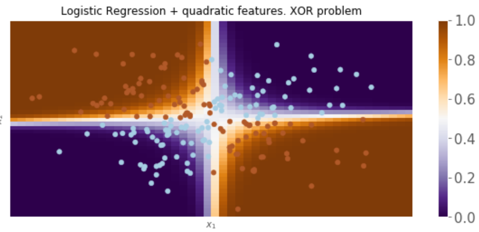

Применение житейской смекалки для создания признаков: есть количество комнат и стоимость аренды. Выделяем новый признак --- стоимость аренды одной комнаты:
```
rooms = df["bedrooms"]
df["price_per_bedroom"] = df["price"] / rooms
```

Отбор признаков:
1. Чисто статистическими методами
2. С использованием моделей
3. Перебором

##### Статистические методы. Отсечение низко вариативных признаков

1. Если признак имеет одинаковые значения на всех элементах выборки за исключением очень небольшого подмножества, то такой признак скорее всего не будет полезен.
2. Такой же вывод можно сделать для признаков, имеющих одинаковые значения для всех элементов выборки.

Чтобы посчитать численно насколько признак вариативен можно посчитать дисперсию этого признака. Дисперсия будет давать $$0$$ для случая $$2$$ и число, близкое к $$0$$ для случая $$1$$.

$$D = \frac{\sum_{i=1}^n (X_i - \bar X)^2}{n}$$, где $$\bar X$$ --- среднее значение признака в датасете $$X$$.

В качестве бейзлайна можно воспользоваться отбором признаков по пороговому значению дисперсии.

>**!ВАЖНО ПОМНИТЬ:**
Необходимо, чтобы все признаки в датасете при таком подходе имели одинаковый разброс значений. Т.е. максимальное и минимальное значение должно быть одинаковым для всех признаков, чтобы сравнение значений их дисперсий было корректным. Для соблюдения этого условия удобно воспользоваться `MinMaxScaler`.

```
# сгенерируем признаки с разбросом 0..1
from sklearn.feature_selection import VarianceThreshold
from sklearn.datasets import make_classification

x_data_generated, y_data_generated = make_classification(scale=1)
print("data shape: ", x_data_generated.shape)
```
Output: `data shape:   (100, 20)`

```
VarianceThreshold(.7).fit_transform(x_data_generated).shape
```
Output: `(100, 19)`

```
VarianceThreshold(.8).fit_transform(x_data_generated).shape
```
Output: `(100, 18)`

```
VarianceThreshold(.9).fit_transform(x_data_generated).shape
```
Output: `(100, 13)`

### Отбор $$k$$ лучших с помощью ANOVA

ANOVA --- ANalysis Of VAriance (или дисперсионный анализ).

Для каждого признака из датасета мы можем посчитать его выразительную способность. Т.е мы можем получить число, показывающее насколько сильно данный признак различается между различными классами из $$Y$$. Упрощенное объяснение следующее:
1. Используем знания о лейблах $$Y$$. Считаем дисперсию данного признака внутри каждого класса из $$Y$$.
2. Считаем дисперсию данного признака между группами, которые задает $$Y$$.
3. Финальный скор --- отношение дисперсии между группами к дисперсии внутри групп.

Для лучшего понимания можно посмотреть [видео 1](https://youtu.be/ITf4vHhyGpc) (тут интуиция) и [видео 2](https://youtu.be/q48uKU_KWas) (тут математика).
Такой скор можно использовать для ранжирования признаков по их значимости. Реализация из `sklearn` позволяет заранее задать число признаков, которое мы хотим оставить исходя из полученных с помощью метода ANOVA скоров.

```
from sklearn.feature_selection import SelectKBest, f_classif

# Выбираем 5 лучших фичей с помощью скоринговой функции для классификации f_classif в методе ANOVA
x_data_kbest = SelectKBest(f_classif, k=5).fit_transform(x_data_generated, y_data_generated)

# Выбираем фичи по граничному значению дисперсии данных
x_data_varth = VarianceThreshold(.9).fit_transform(x_data_generated)
```

```
from sklearn.linear_model import LogisticRegression
from sklearn.model_selection import cross_val_score

# Результат для исходных данных
cross_val_score(LogisticRegression(), x_data_generated, y_data_generated, scoring='accuracy').mean()
```
Output: `0.8805147058823529`

```
# Для отбора по вариативности
cross_val_score(LogisticRegression(), x_data_varth, y_data_generated, scoring='accuracy').mean()
```
Output: `0.8805147058823529`

```
# Для отбора по ANOVA
cross_val_score(LogisticRegression(), x_data_kbest, y_data_generated, scoring='accuracy').mean()
```
Output: `0.9399509803921569`

### Использование моделей

Для отбора признаков чаще всего используют L1 регуляризацию с линейной/логистической регрессией или случайный лес (о котором вы пока не знаете)

```
from sklearn.datasets import make_classification
from sklearn.linear_model import LogisticRegression
from sklearn.feature_selection import SelectFromModel
from sklearn.model_selection import cross_val_score
from sklearn.pipeline import make_pipeline

# Еще раз покажем результат с простой моделью и исходными данными

lr = LogisticRegression()
print(cross_val_score(lr, x_data_generated, y_data_generated, scoring='accuracy').mean())
```
Output: `0.8805147058823529`

```
# Теперь произведем отбор признаков с помощью нашей логистической регрессии,
# Отобранные признаки подадим далее в саму логистическую регрессию

pipe = make_pipeline(SelectFromModel(estimator=LogisticRegression(penalty='l1',)), LogisticRegression())
print(cross_val_score(pipe, x_data_generated, y_data_generated, scoring='accuracy').mean())
```
Output: `0.9001225490196078`

Также возможно рекурсивное удаление признаков из датасета с помощью `sklearn.feature_selection.RFE`.
В этом случае после удаления наихудшего признака по меркам коэффициентов регрессии, модель будет обучена заново на уже меньшем подмножестве признаков. Затем процесс с удалением признака и переобучением модели повторяется, пока не достигнуто желаемое количество лучших признаков.

**SequentialFeatureSelector** --- жадный алгоритм поиска подмножества из $$k$$ признаков на основании результатов кросс-валидации. Может быть использован с любой моделью.
Имеет 2 основных сеттинга:
- Sequential Forward Selection (SFS)
  > Начальное число избранных признаков $$0$$.
  Алгоритм добавляет на каждом шаге один признак, который максимизирует скор на кросс-валидации. Алгоритм останавливает добавление новых признаков, когда достигнуто необходимое число этих признаков. Используется по дефолту в `SequentialFeatureSelector`.
- Sequential Backward Selection (SBS)
  > Начальное число избранных признаков $$N$$ (т.е все признаки включены в коллекцию).
  Алгоритм убирает из коллекции на каждом шаге один признак, удаление которого максимизирует скор на кросс-валидации. Алгоритм останавливает удаление признаков, когда достигнуто необходимое число этих признаков. Параметр `forward=False` в `SequentialFeatureSelector`.

```
# устанавливаем mlxtend:
!pip install mlxtend
```

```
from mlxtend.feature_selection import SequentialFeatureSelector

selector = SequentialFeatureSelector(LogisticRegression(), scoring='accuracy',
                                     verbose=2, k_features=7, forward=True, n_jobs=-1)

selector.fit(x_data_generated, y_data_generated)
```
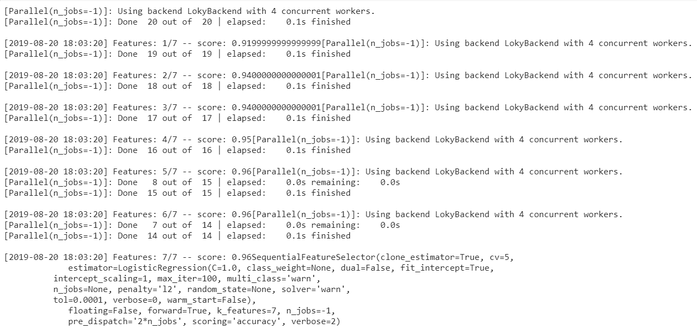

Итак, удалось достаточно неплохо улучшить accuracy с этим методом по сравнению с предыдущими, однако, это синтетическая задачка. С реальными данными все намного сложнее.

### KaggleInClass

Начнем решать соревнование на платформе Kaggle (пока только InClass)
Ссылка на соревнование:

```
df = pd.read_csv("./test.csv")
df.head()
```

```
df.manager_id.nunique()
```
Output: `2148`


