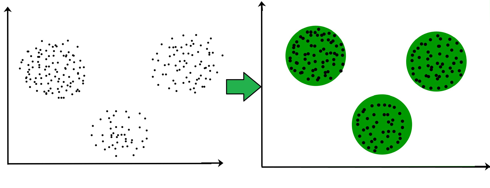

## Unsupervised Learning

Вам необходимо скачать приложенный файл для сегодняшнего занятия:
// файлик

### Обучение без учителя

Ранее мы рассматривали в основном только задачи, где у части данных (тренировочной) была размечена целевая функция (таргет), а для другой части данных (тестовой) таргета нет, и мы хотели его восстановить. Такие задачи (классификация, регрессия, ранжирование), как вы помните, называются  **обучением с учителем**  (supervised learning).

Давайте посмотрим теперь на задачи, в которых таргета не дано --- но все же что-то сопоставить каждому элементу надо. Такие задачи называются **обучением без учителя**  (unsupervised learning).

**Примеры таких задач**: 
- кластеризация
- уменьшение размерности
- визуализация
- вложение в пространство

Одна из особенностей обучения без учителя --- нам не нужны тренировочная и тестовая выборка. Нет таргета --- нет проблем с переобучением.

Задачу кластеризации вы знаете: она состоит в разделении точек в пространстве на кластеры близко расположенных.

Рассмотрим несколько известных алгоритмов кластеризации.

### Алгоритм K-Means

[Визуализация.](https://www.naftaliharris.com/blog/visualizing-k-means-clustering/)

Нужно в начале выбрать $$K$$ центров кластеров ($$K$$ --- константа, которую надо самому выбрать).
Далее итеративно выполняются $$2$$ шага, пока обновления не перестанут происходить:
1. Обновить кластеры, приписав каждой точке кластер самого близкого к ней центра
2. Обновить центр каждого кластера как центр масс его точек

*Плюсы:*
- простой и понятный

*Минусы:*
- нужно знать $$K$$
- слишком простая модель, кластер = выпуклая околокруглая штука, так как это по сути диаграмма Вороного (если вы знаете, что это такое)
- если плохо выбрать начальные центры, может сойтись к плохому результату

Поэтому обычно K-Means запускают несколько раз и выбирают лучший результат.

### Метрика качества кластеризации

Как и для задач обучения с учителем, хочется уметь понимать, хорошо ли мы решили задачу --- нужно научиться измерять качество кластеризации. Так, например, даже не зная число кластеров, можно перебрать $$K$$ в K-Means и выбрать гиперпараметр с лучшим качеством.

Одним из примеров метрики может быть метрика **силуэт**. Для одного элемента $$x$$ она считается так:
$$S(x) = \frac{b(x) - a(x)}{\max{(a(x), b(x))}}$$

$$a(x)$$ --- среднее расстояние от $$x$$ до точек внутри того же кластера
$$b(x)$$ --- среднее расстояние от $$x$$ до точек внутри ближайшего кластера

Значение метрики силуэт лежит в диапазоне значений $$[0.0, 1.0]$$, и ее можно посчитать для каждого примера и для кластера.
Значение силуэта для кластера равно среднему значению $$S(x)$$ от каждого элемента. Чем он больше тем лучше кластер отделим от других кластеров.

Примеры из выборки можно отсортировать по значению силуэта для каждого примера и по присвоенной метке кластера. Такое представление позволяет отфильтровать шумные примеры (у которых силуэт меньше некоторого порога).

### DBSCAN

[Визуализация.](https://www.naftaliharris.com/blog/visualizing-dbscan-clustering/)

DBSCAN строит столько кластеров, сколько получится, причем многие вершины могут не войти ни в один кластер, они называются выбросами.

DBSCAN опирается на два гиперпараметра:
- eps --- означает расстояние, на котором две вершины считаются соседями
- min_samples --- означает сколько нужно соседей из кластера, чтобы считать вершину коренной вершиной кластера

Сам алгоритм состоит из таких шагов:
1. Выбрать соседей для каждой вершины на расстоянии до eps
2. Найти компоненты связности коренных вершин --- добавляем вершину в компоненту коренных, если у нее хотя бы min_samples соседей лежат в этой компоненте
3. Добавить оставшиеся вершины в самый популярный кластер соседей, если есть соседи
4. Оставшиеся вершины - это выбросы

*Плюсы:*
- сам подберет число кластеров
- опирается на плотность точек, кластеры могут быть вытянутыми и даже невыпуклыми

*Минусы:*
- нужно подбирать два других параметра
- алгоритм считает, что в разных частях данных плотности должны быть примерно одинаковыми

### Агломеративная кластеризация

Интуиция у алгоритма очень простая:
1. Начинаем с того, что высыпаем на каждую точку свой кластер
2. Сортируем попарные расстояния между центрами кластеров по возрастанию
3. Берём пару ближайших кластеров, склеиваем их в один и пересчитываем центр кластера
4. Повторяем п. 2 и 3 до тех пор, пока все данные не склеятся в один кластер

Чтобы найти пару ближайших кластеров берут не только расстояние между центрами, бывают и такие метрики:
- *Single linkage* --- минимум попарных расстояний между точками из двух кластеров
- *Complete linkage* --- максимум попарных расстояний между точками из двух кластеров
- *Average linkage* --- среднее попарных расстояний между точками из двух кластеров
- *Centroid linkage* --- расстояние между центроидами двух кластеров

По итогам выполнения такого алгоритма строится дерево склеивания кластеров. Глядя на него можно определить, на каком этапе оптимальнее всего остановить алгоритм.

### Уменьшение размерности и визуализации

Обе эти задачи состоят в **сжатии выборки**: нужно перевести точки из $$N$$-мерного пространства в $$M$$-мерное пространство, где $$M<N$$, причем так, чтобы близкие точки остались близкими. То есть хочется значительно уменьшить число признаков, не сильно потеряв (или даже улучшив) их качество.

Для примеров мы будем чаще всего переводить в $$2$$-мерное пространство --- это заодно и хороший способ **визуализировать** датасет.  Помимо визуализации уменьшение размерности очень часто используют для **отбора признаков**. Вместо $$64$$ малозначащих признаков мы хотим оставить $$2$$, в которых лежит как можно больше информации. Заметьте, что это *слабый способ отбора признаков*: мы никак не используем значение таргета. 

### SVD --- используем матрицы

В этом методе уменьшения размерности применяется SVD-разложение матрицы признаков.
Что это такое? Это единственное представление матрицы в виде произведения трех других:

$$A=U \Sigma V$$

где $$A$$ --- прямоугольная матрица признаков, $$\Sigma$$ --- прямоугольная диагональная, причём числа на диагонали неотрицательны и убывают, $$U, V$$ квадратные и унитарные (не важно, что это значит, но по смыслу это что-то вроде поворота пространства). Нас больше всего будет интересовать матрица $$\Sigma$$.

### PCA --- метод главных компонент

[Визуализация](http://setosa.io/ev/principal-component-analysis/) выделения первой и второй главных компонент методом PCA.

[Метод PCA](https://ru.wikipedia.org/wiki/%D0%9C%D0%B5%D1%82%D0%BE%D0%B4_%D0%B3%D0%BB%D0%B0%D0%B2%D0%BD%D1%8B%D1%85_%D0%BA%D0%BE%D0%BC%D0%BF%D0%BE%D0%BD%D0%B5%D0%BD%D1%82) заключается в том, чтобы найти в $$N$$-мерном пространстве такое $$K$$-мерное пространство, что проекция всех точек на него будет как можно более рассеянной (то есть иметь наибольшую дисперсию).

- Оказывается, подходит пространство, сумма квадратов расстояния от которого до всех точек минимальна.
- Первая компонента (ось) выбирается так, чтобы дисперсия проекции вдоль нее была максимальна.
- После этого все точки проецируются вдоль первой компоненты и там таким же способом выбирается вторая компонента и так далее.
- Получившиеся $$K$$ компонент будут образовывать $$K$$-мерное пространство, проекция точек на которое будет иметь наибольшую дисперсию.

Оказывается, если применить TruncatedSVD к центрированным данным (среднее по каждой координате равно $$0$$), то именно это и получится!

В каком-то смысле PCA --- это лучший линейный способ уменьшить размерность пространства.

*Плюсы PCA:* 
- считается относительно быстро
- детерминированность (зависит от реализации, в sklearn не так)
- любая размерность
- полученную модель уменьшения размерности можно применять и к новым точкам (нужно просто спроецировать ее на выделенное $$K$$-мерное пространство)
- визуализация при $$K = 2$$ --- это честная проекция на какую-то плоскость, легкая интерпретируемость результатов
- при увеличении размерности старые координаты не меняются
- отлично подходит для отбора признаков

*Минусы PCA:*
- алгоритм слишком простой --- он линейный
- некоторые непохожие точки могут спроецироваться в одну и ту же при $$K = 2$$

### t-SNE

[Визуализация](https://distill.pub/2016/misread-tsne/) метода уменьшения размерности t-SNE.

Это гораздо более сложный нелинейный [алгоритм](https://habr.com/post/267041/). Он очень крут для визуализации данных, и работает только с переводом в 2D и 3D.
Внутри там происходит что-то физическое --- элементы будто разлетаются, причем чем дальше они друг от друга, тем сильнее они друг друга отталкивают.

*Плюсы t-SNE*:
- отлично визуализирует (2D, 3D) данные
- физически разносит разные точки дальше друг от друга
- сильно разные точки не могут в конце оказаться рядом

*Минусы t-SNE*:
- недетерминированность, результат меняется при каждом запуске
- координаты ничего не значат сами по себе
- **нельзя легко добавить новые данные (т.к. нет явной функции отображения в новое пространство)!**
- долго работает
- уменьшает только до 2 и 3 размерности

### Применение уменьшения размерности для классификации

Часто предварительное уменьшение размерности помогает лучше решать задачу **обучения с учителем** (например классификацию). Это помогает меньше переобучаться и позволяет алгоритмам обучаться быстрее (часть данных выкинули).

**P.s. При обучении алгоритм уменьшения размерности не должен видеть тестовых данных, это приведет к переобучению!**

