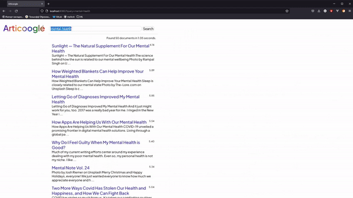

ПРОЧИТАТЬ ПЕРЕД ЗАПУСКОМ

1. Скачать и распаковать в папку архив https://drive.google.com/file/d/1O_Oq1tHL23C4VWvpn301EeAcer37rXae/view?usp=sharing
2. Запустить server.py, радоваться и поставить хорошую оценку

Я скачал 190k статей с сайта Medium https://www.kaggle.com/datasets/fabiochiusano/medium-articles
Я использовал TF-IDF в функции скоринга, предварительно проведя стемминг заголовков, текстов, тегов.
Также я использовал веса, потому что считаю, что если слово употребляется в теге или заголовке, то вероятнее, что текст подходит.
Веса эти я поставил руками, не используя модели
